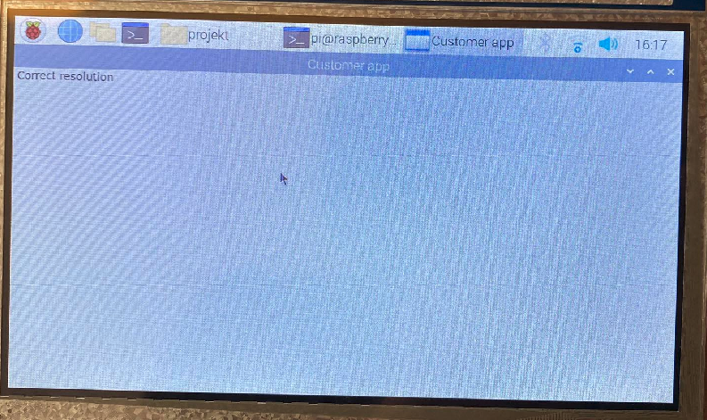
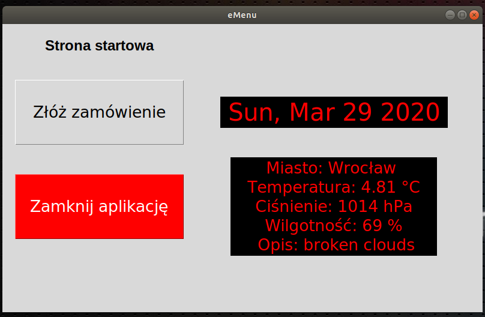
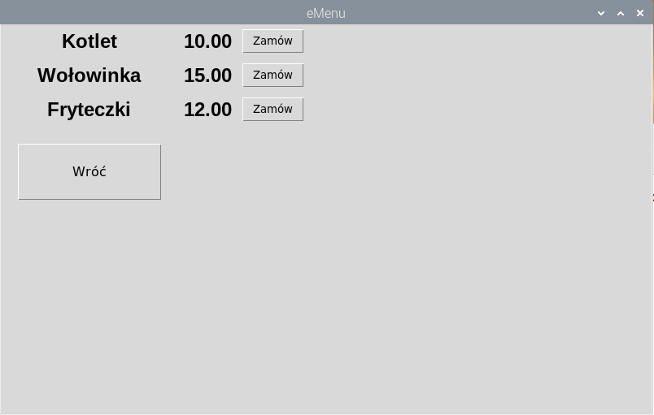
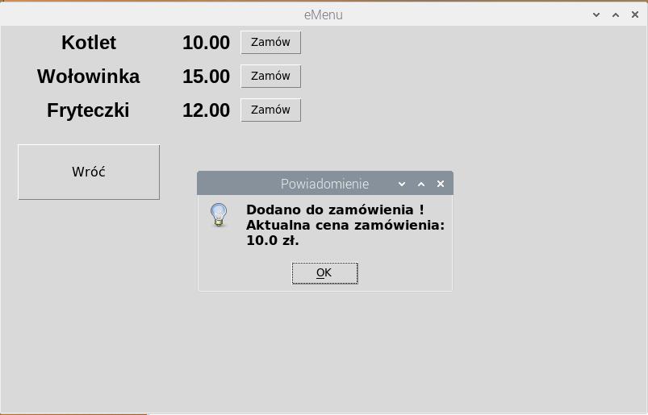
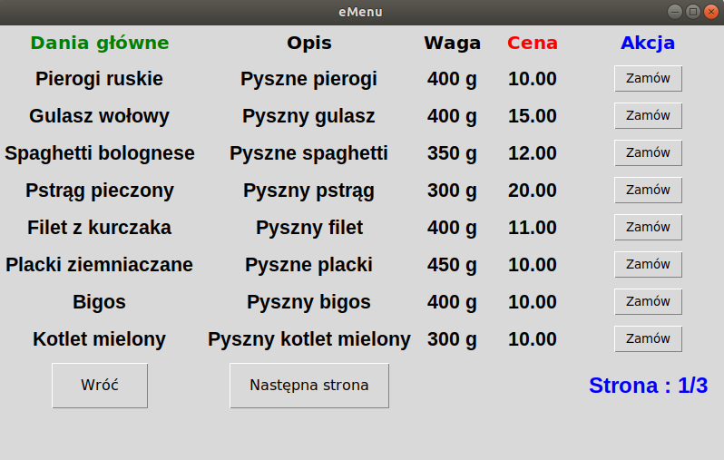

# Raspberry_python_app

An app for Raspberry Pi with touch screen to send customer's orders. 

# First step 

Configured Raspberry Pi and touch display.  
  
Changed resolution for touch screen in boot config file.
```sh
$ cd boot/
```

Changes done in _config.txt_ file : 

> max_usb_current=1     
> hdmi_group=2     
> hdmi_mode=87     
> hdmi_cvt 800 480 60 6 0 0 0     
> hdmi_drive=1    

	   	       
Loaded first simple program with correct resolution : 

```python
# Added a Python package for GUI apps    
from tkinter import *  
   
# Inicialazing new window  
window = Tk()  
  
# Window title and resolution   
window.title("Customer app")  
window.geometry('800x480')  
   
# Main loop   
window.mainloop()  
```



# Second step

- Added weather API, some buttons, date function.   
- Tried adding background photo, but wasn't able to do it.



# Third step

- Added buttons and labels dynamically based on XML file.   
- Added to every single button function 'order' ( dynamically too ).   
- Added product prices, actual bill and message box showing actual bill while ordering.




## XML file example :

```xml
<root>
	<dish>
		<title>Kotlet</title>
		<price>10.00</price>
	</dish>

	<dish>
		<title>Wołowinka</title>
		<price>15.00</price>
	</dish>

	<dish>
		<title>Fryteczki</title>
		<price>12.00</price>
	</dish>
</root>
```

# Fourth step 

- Cleared code.  
- Added some changes in xml file.  
- Organized files.   
- Made some functions in order not to repeat code.  




