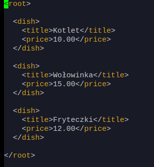

# Raspberry_python_app  ( new features on branch develop ) 
An app for Raspberry Pi with touch screen to send customer's orders. 

# First step 

Changed resolution for touch screen in boot config file.
```sh
$ cd boot/
```

Changes done in _config.txt_ file : 

> max_usb_current=1 

> hdmi_group=2 

> hdmi_mode=87 

> hdmi_cvt 800 480 60 6 0 0 0 

> hdmi_drive=1


Configured Raspberry Pi and touch display. 
Loaded first simple program with correct resolution. 


# Second step

Added weather API, some buttons, date function. 
Tried adding background photo, but wasn't able to do it.


# Third step

Added buttons and labels dynamically based on XML file. 
Added to every single button function 'order' ( dynamically too ). 
Added product prices, actual bill and message box showing actual bill while ordering.


XML file example :


